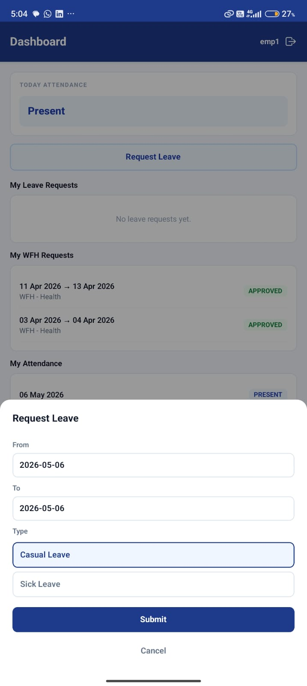
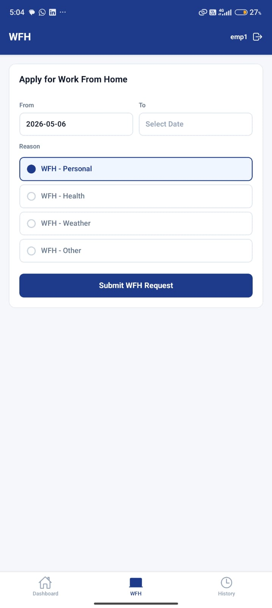
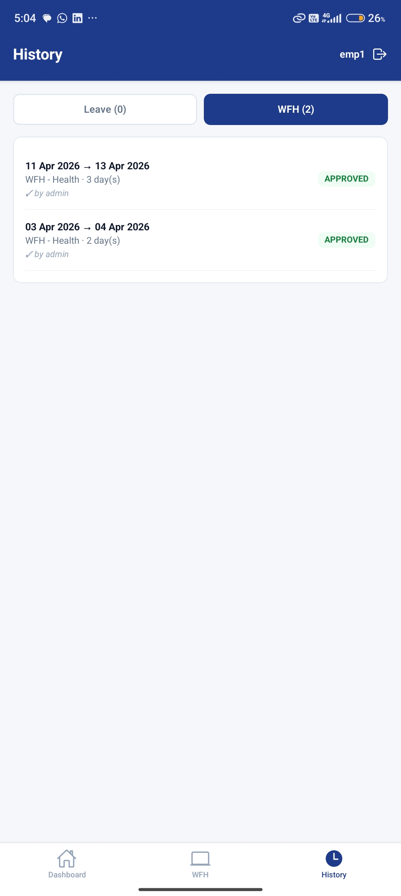
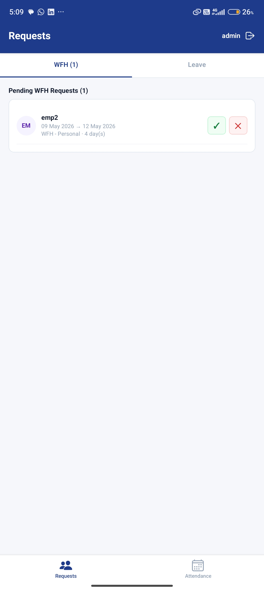

# AMS — Attendance Management System

A full-stack mobile-based Attendance Management System developed using **React Native**, **Django REST Framework**, and **MySQL**.

The application enables employees to manage attendance, apply for leave/work-from-home requests, and allows administrators to monitor attendance records and manage employee requests efficiently.

---

# Application Screenshots

| User Dashboard | Apply WFH |
|---|---|
|  |  |

| Pending Requests | Admin Dashboard |
|---|---|
|  |  |

---

# Project Overview

AMS is a role-based attendance management application designed to streamline employee attendance tracking and remote work request management.

The system consists of:

- React Native Mobile Frontend
- Django REST Backend APIs
- MySQL Database
- JWT Authentication System

---

# System Architecture

```text
React Native App
       ↓
Axios API Layer
       ↓
Django REST APIs
       ↓
JWT Authentication
       ↓
Django ORM
       ↓
MySQL Database
```

---

# Tech Stack

| Layer | Technology |
|---|---|
| Frontend | React Native (Expo) |
| Backend | Django REST Framework |
| Database | MySQL |
| Authentication | JWT (JSON Web Tokens) |
| API Communication | Axios |

---

# Core Features

## Authentication

- User Registration
- Secure JWT Login
- Persistent Session Management
- Role-Based Access Control

---

## Employee Features

- Mark Attendance
- Apply for Work From Home (WFH)
- Apply for Leave
- View Attendance History

---

## Admin Features

- Dashboard Analytics
- Approve / Reject WFH Requests
- Approve / Reject Leave Requests
- Monitor Employee Attendance

---

# Backend Flow

```text
Django Views
     ↓
Serializers
     ↓
Models
     ↓
MySQL Database
```

---

# Authentication Flow

```text
User Login
    ↓
JWT Token Generated
    ↓
Token Stored in AsyncStorage
    ↓
Authenticated API Requests
```

---

# Setup Instructions

## Backend Setup

### Create MySQL Database

```sql
CREATE DATABASE ams_db CHARACTER SET utf8mb4;
```

### Install Dependencies

```bash
pip install -r requirements.txt
```

### Run Migrations

```bash
python manage.py migrate
```

### Create Admin User

```bash
python manage.py createsuperuser
```

### Start Django Server

```bash
python manage.py runserver 0.0.0.0:8000
```

---

# Frontend Setup

```bash
cd amsapp
npm install --legacy-peer-deps
```

Update backend API URL inside:

```text
src/services/api.js
```

Run Expo Application:

```bash
npx expo start --clear
```

---

# Key Technical Concepts

- REST API Architecture
- JWT Authentication
- Role-Based Authorization
- Context API State Management
- Axios Request Interceptors
- Django ORM Integration

---

# Conclusion

The AMS application demonstrates a complete full-stack mobile architecture integrating React Native frontend, Django REST backend, JWT-based authentication, and MySQL database management for attendance and employee workflow handling.
